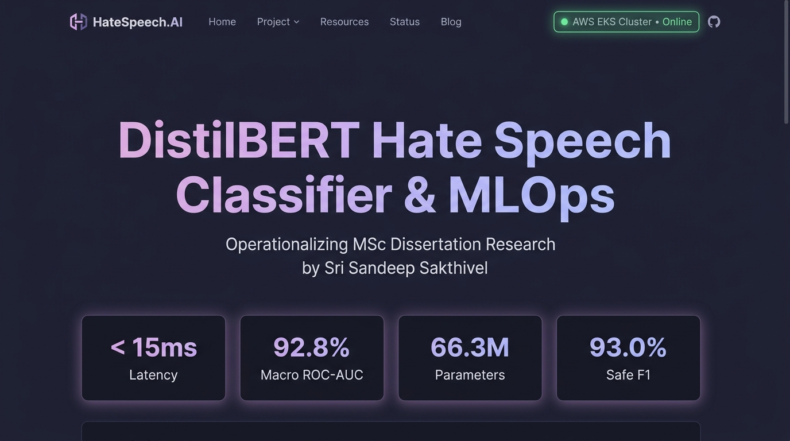
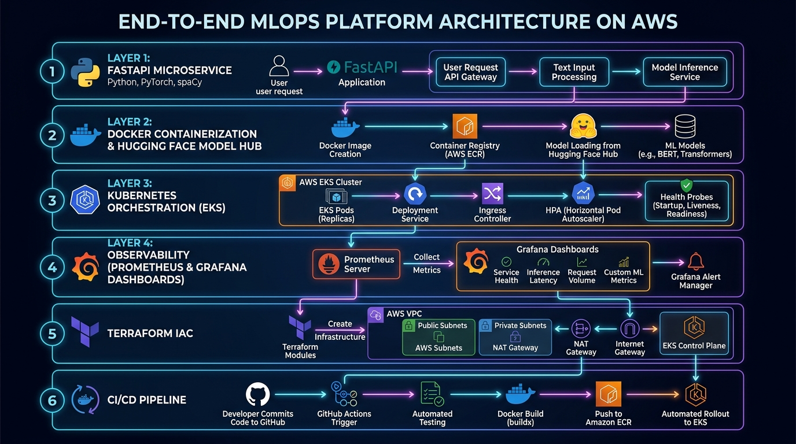
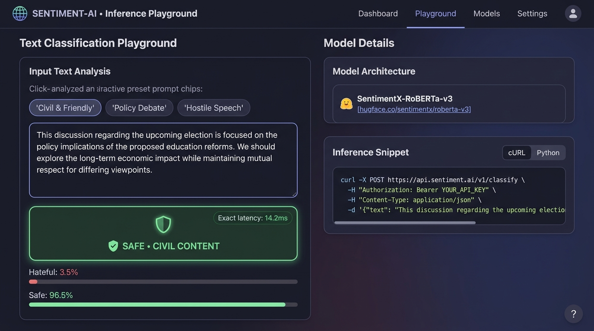
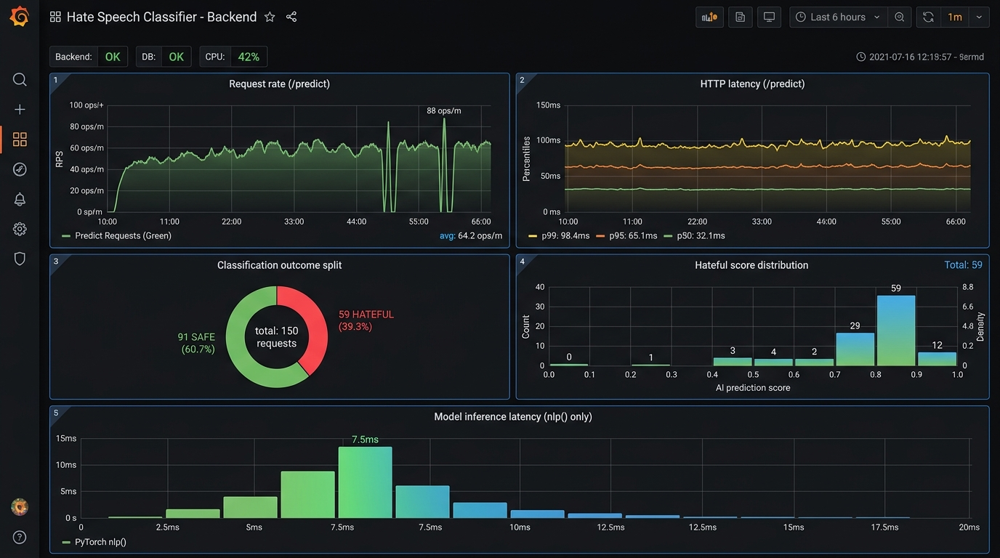

# 🛡️ DistilBERT Hate Speech Classifier — Cloud-Native MLOps Platform

[](https://github.com/sri-sandeep108/hate-speech-classifier/actions/workflows/ci-cd.yml)
[](https://huggingface.co/thenewguyhere/hate-speech-distilbert)
[](https://aws.amazon.com/eks/)
[](https://www.terraform.io/)
[](https://prometheus.io/)
[](https://react.dev/)

An end-to-end cloud-native MLOps platform operationalizing MSc dissertation research by **Sri Sandeep Sakthivel** (*MSc in Data Analytics*) into a high-throughput, fully observable classification system deployed on **Amazon Elastic Kubernetes Service (EKS)**.

---

## 📸 Platform Overview & Live Showcase



### 🌟 Key Highlights
- **⚡ High-Throughput Transformer Serving**: Fine-tuned **DistilBERT TextCatEnsemble** (~66.3M parameters, ~265MB weights) achieving **< 15ms** pure inference latency and **92.8% Macro ROC-AUC**.
- **💎 Designer-Grade React SPA**: Responsive modern frontend built with **React 18, Vite, TypeScript, and Tailwind CSS (Catppuccin Mocha theme)**, served via an ultra-lightweight **Nginx** reverse proxy container (< 15MB RAM).
- **🏗️ Reproducible Infrastructure as Code**: 100% automated AWS cloud provisioning via **Terraform** (VPC, 2 Public + 2 Private Subnets, NAT Gateway, EKS v1.31 Control Plane, Managed Node Groups, ECR registries, IAM OIDC).
- **📊 Real-Time Cloud Observability**: **Prometheus Operator (`kube-prometheus-stack`)** and pre-configured **Grafana** dashboard tracking custom PyTorch model histograms, classification outcome distributions, and request latencies.
- **🚀 Automated CI/CD Deployment**: **GitHub Actions** multi-stage pipeline executing Ruff linters, Pytest suites, Vite build checks, multi-platform Docker Buildx, Amazon ECR push, and zero-downtime rolling updates to EKS.
- **📄 Research Artifacts**: Embedded MSc Dissertation research paper (`Dissertation.pdf`, 4.1 MB) directly downloadable and cited within the platform.

---

## 🏛️ 6-Layer Production Architecture Blueprint



The system is constructed as six discrete, explainable engineering layers:

```
hate-speech-classifier/
├── backend/                       # Layer 1: FastAPI Microservice (PyTorch/spaCy TextCatEnsemble)
│   ├── app/
│   │   ├── main.py                # REST routes (/predict, /health, /info), metrics instrumentation
│   │   ├── model.py               # Singleton model loader (HF Hub / local), Prometheus metrics
│   │   ├── model_info.py          # Benchmark metrics & architecture metadata
│   │   └── schemas.py             # Pydantic request/response validation schemas
│   ├── Dockerfile                 # Layer 2: Multi-stage non-root container image (Uvicorn :8000)
│   └── requirements.txt           # spaCy, spacy-transformers, torch, fastapi, uvicorn
├── frontend/                      # Layer 1 & 2: Modern React 18 + Vite SPA
│   ├── src/
│   │   ├── components/            # Navbar, Hero, InferenceStudio, Dissertation, Architecture, About, Footer
│   │   ├── data/                  # Dissertation research data, 5-model benchmark matrix, 6 DevOps layers
│   │   ├── App.tsx                # Main application layout
│   │   └── main.tsx               # React DOM entrypoint
│   ├── nginx.conf                 # Production Nginx reverse proxy and SPA routing
│   ├── Dockerfile                 # Multi-stage build (node:22-alpine -> nginx:alpine)
│   ├── tailwind.config.js         # Catppuccin Mocha theme configuration
│   └── package.json               # React 18, Vite, Lucide Icons, Tailwind CSS
├── k8s/                           # Layer 3 & 4: Kubernetes Orchestration & Observability
│   ├── backend.yaml               # Deployment + ClusterIP Service + Startup/Liveness Probes (4Gi RAM)
│   ├── frontend.yaml              # Deployment + LoadBalancer Service (:80) + Nginx Probes (128Mi RAM)
│   ├── configmap.yaml             # Environment configuration (HF_MODEL_REPO, API_URL)
│   ├── backend-servicemonitor.yaml# Prometheus Operator CRD to scrape backend /metrics
│   ├── kustomization.yaml         # Kustomize manifest bundle + Grafana dashboard generator
│   └── monitoring/
│       ├── values.yaml            # Tuned Helm values for kube-prometheus-stack
│       └── dashboards/
│           └── backend.json       # Pre-configured Grafana dashboard (7 model telemetry panels)
├── terraform/                     # Layer 5: Infrastructure as Code (AWS EKS & VPC)
│   ├── versions.tf                # Terraform & AWS provider requirements (v5.0+)
│   ├── vpc.tf                     # Custom VPC, 2x Public + 2x Private Subnets, IGW, NAT Gateway
│   ├── iam.tf                     # EKS Control Plane & Node Group IAM roles, OIDC IRSA provider
│   ├── eks.tf                     # EKS Cluster (v1.31) and Managed Node Groups (2x t3.large)
│   ├── ecr.tf                     # ECR repositories for backend and frontend with lifecycle rules
│   └── outputs.tf                 # Cluster endpoint, ECR URLs, kubectl authentication helper
├── .github/workflows/             # Layer 6: CI/CD Pipeline
│   └── ci-cd.yml                  # Automated Test -> Docker Buildx -> ECR Push -> EKS Rollout
├── scripts/
│   ├── generate_traffic.py        # High-throughput load generator & telemetry simulator
│   └── upload_model_to_hf.py      # Utility to package and upload spaCy models to Hugging Face
└── docker-compose.yml             # Local multi-container development environment
```

---

## 💬 Live Inference Studio



The interactive studio allows real-time sentiment and hate speech analysis with:
- **Sample Presets**: Quick-fill buttons covering *Civil & Friendly*, *Policy Debate*, *Workshop Notice*, *Hostile Speech*, and *Severe Violation*.
- **Dynamic Classification Banner**: Instant color-coded safety indicators (*🛡️ Safe • Civil Content* vs. *⚠️ Hate Speech Detected*).
- **Exact Latency Breakdown**: Tracks pure PyTorch execution vs. round-trip network time in milliseconds.
- **Developer Code Generator**: Ready-to-copy integration code in `cURL`, `Python (requests)`, and `TypeScript (fetch)`.

---

## 📄 Academic Research & 5-Model Empirical Benchmarks

Authored by **Sri Sandeep Sakthivel** (*MSc in Data Analytics*, Student ID: `20065749`), the underlying research evaluated 5 NLP architectures on an aggregated dataset (Kaggle & GitHub) to investigate the trade-offs between parameter scale, classification accuracy, and serving latency.

### 🏆 Empirical Benchmark Matrix

| Architecture | Base Weights | Params | Footprint | Macro F1 | Macro AUC | Minority Hate F1 | Latency / Speed | Cloud Production Decision |
| :--- | :--- | :--- | :--- | :--- | :--- | :--- | :--- | :--- |
| **DistilBERT (Selected)** | `distilbert-base-uncased` | **~66.3M** | **~265 MB** | **0.8109** | **0.9277** | **0.6918** | **1.17x faster** | 🚀 **Production Target (Fast & Optimal)** |
| **RoBERTa Base** | `roberta-base` | ~125M | ~500 MB | 0.8142 | 0.9320 | 0.6945 | 0.85x | Marginal +0.3% F1 gain; 2x memory footprint |
| **BERT Base** | `bert-base-uncased` | ~110M | ~440 MB | 0.8034 | 0.9192 | 0.6780 | 1.00x (Baseline) | Standard baseline; outpaced by DistilBERT |
| **ELECTRA Base** | `google/electra-base` | ~110M | ~440 MB | 0.7981 | 0.9154 | 0.6690 | 0.98x | Token discriminator; lower sensitivity on subtle hate |
| **Static GloVe 300d** | `glove.6B.300d + Linear` | ~2.2M | ~12 MB | 0.7120 | 0.8410 | 0.5420 | 4.50x | Fast bag-of-words; failed on polysemy & negation |

### 💡 Core Research Takeaways
1. **The Performance-Efficiency Paradox**: Sheer parameter volume does not guarantee proportional classification gains. DistilBERT (~66M params) preserved 99.6% of RoBERTa's performance while cutting model size by ~47% and speeding up inference by ~17%.
2. **Mitigating Moderator Trauma**: High-recall automated triage reduces the volume of toxic, psychologically damaging content that human review teams must process.
3. **Linguistic Context & The Scunthorpe Problem**: Transformer self-attention resolves false positives caused by static substring blacklists.
4. **Human-in-the-Loop (HITL) Synergy**: Due to precision ceilings on edge cases, automated classification serves as a front-line triage engine, routing borderline scores (0.40–0.70) to human moderators.

---

## 📊 Cloud Observability (Prometheus & Grafana)



The backend exposes custom domain and HTTP metrics at `GET /metrics`:
- `predict_classifications_total{label="Hateful|Not-Hateful"}`: Counter of classifications.
- `predict_hateful_score`: Histogram tracking model confidence distribution.
- `predict_inference_seconds`: Histogram tracking pure PyTorch/spaCy compute time (excluding HTTP).
- `predict_input_text_length_chars`: Histogram tracking payload character length.
- `http_requests_total` & `http_request_duration_seconds`: API throughput and latency percentiles.

### 🧪 Generating Test Traffic
To simulate realistic traffic and populate the Grafana dashboard:

```bash
# Generate 150 concurrent requests across safe and hateful prompts
./scripts/generate_traffic.py --url "http://<YOUR_LOADBALANCER_URL>" --requests 150 --concurrency 6
```

---

## ⚡ Quick Start & Local Development

### 1. Run with Docker Compose
```bash
# Starts FastAPI backend (port 8000) and React/Nginx frontend (port 5173 / 8501)
docker compose up --build
```

### 2. Run Manually

**Backend (Python 3.12)**:
```bash
cd backend
python3 -m venv .venv && source .venv/bin/activate
pip install -r requirements.txt
HF_MODEL_REPO=thenewguyhere/hate-speech-distilbert uvicorn app.main:app --reload --port 8000
```

**Frontend (React + Vite)**:
```bash
cd frontend
npm install
VITE_API_URL=http://localhost:8000 npm run dev
```

---

## ☁️ Cloud Deployment (AWS EKS via Terraform)

### 1. Provision Infrastructure
```bash
cd terraform
terraform init
terraform plan
terraform apply -auto-approve

# Configure kubectl credentials
aws eks update-kubeconfig --region us-east-1 --name hate-speech-classifier-eks
```

### 2. Deploy Observability Stack (Helm)
```bash
helm repo add prometheus-community https://prometheus-community.github.io/helm-charts
helm install monitoring prometheus-community/kube-prometheus-stack \
  -n monitoring --create-namespace -f k8s/monitoring/values.yaml --wait
```

### 3. Deploy Kubernetes Workloads
```bash
kubectl apply -k k8s/
```

---

## 👤 Author & Acknowledgments

- **Researcher & Engineer**: **Sri Sandeep Sakthivel**
- **Degree**: MSc in Data Analytics (Student ID: `20065749`)
- **GitHub**: [@sri-sandeep108](https://github.com/sri-sandeep108)
- **Model Artifact**: [Hugging Face Hub `thenewguyhere/hate-speech-distilbert`](https://huggingface.co/thenewguyhere/hate-speech-distilbert)
- **License**: MIT
